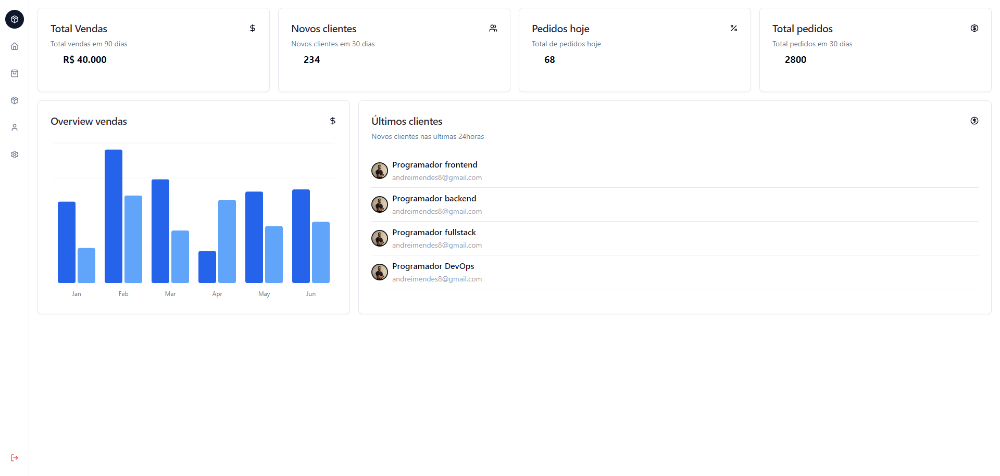
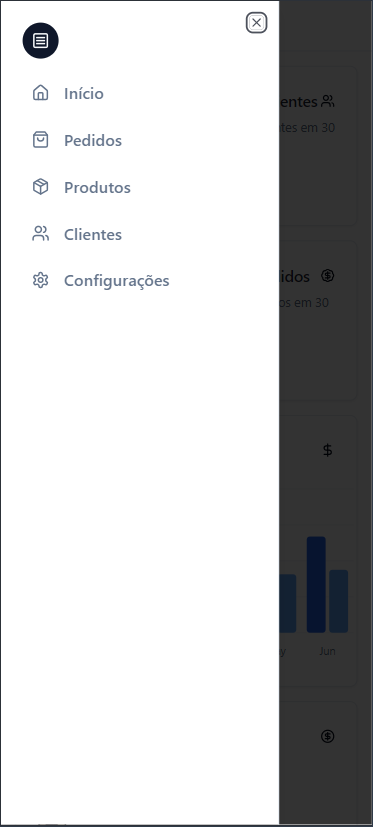
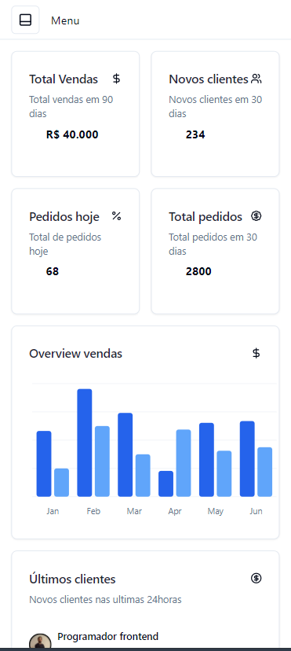

<h1 align="center">
    📊 Painel de Gráficos 📊
</h1>

<h2>Web</h2>

<h2>Mobile</h2>

## 🚀 Sobre 

**📈 Visão Geral:**
Este projeto foi desenvolvido com o intuito de aprofundar meus conhecimentos em frontend, explorando o uso do shadcn/ui para criar interfaces de usuário modernas e acessíveis. Ao longo do desenvolvimento, implementei diferentes componentes fornecidos pelo shadcn/ui, testando sua flexibilidade e personalização em cenários reais. Este projeto serviu como uma excelente oportunidade para experimentar novas práticas de design de interface, melhorar a usabilidade e entender melhor as nuances de um framework UI baseado em componentes.

## 🔨 Tecnologias e Ferramentas

- Javascript
- Typescript
- React
- Nextjs
- Tailwind
- Shadcn/ui

## Link Projeto

<h1>Clique aqui para ir para o projeto ➡ <a href="https://dashboard-estudos.vercel.app/">Painel </a> 
</h1> 

## Shadcn/ui

<h1>https://ui.shadcn.com/</h1>

